# Anomaly detection computation reference

_Exact equations and value definitions implemented by the unified multi-protocol detector._

---

## 🔄 Computation pipeline

```mermaid
flowchart LR
    accTitle: Anomaly Score Computation Pipeline
    accDescr: Zeek records become host-hour feature values, transformed model inputs, robust z-scores, protocol anomalies, and finally global per-IP ensemble anomalies

    records[📥 Read Zeek records] --> group[🗂️ Group by IP protocol hour]
    group --> value[📊 Compute raw value]
    value --> transform[⚙️ Apply log1p]
    transform --> score[🔍 Compute robust z-score]
    score --> decision{Threshold crossed?}
    decision -->|No| adapt[🔄 Update baseline]
    decision -->|Yes| anomaly[⚠️ Emit anomaly]
    anomaly --> adapt
    anomaly --> ensemble[🧠 Combine protocol votes]
    ensemble --> global_check{Global threshold crossed?}
    global_check -->|Yes| output[📤 Emit global IP anomaly]

    classDef process fill:#dbeafe,stroke:#2563eb,stroke-width:2px,color:#1e3a5f
    classDef decision fill:#fef9c3,stroke:#ca8a04,stroke-width:2px,color:#713f12
    classDef warning fill:#fee2e2,stroke:#dc2626,stroke-width:2px,color:#7f1d1d

    class records,group,value,transform,score,adapt,ensemble process
    class decision,global_check decision
    class anomaly,output warning
```



The current observation is always scored against the baseline that existed
before that observation. Only after scoring and anomaly emission does the
detector update the model.

## 📐 Symbols and transformations

| Symbol | Meaning |
| ------ | ------- |
| \(x\) | Raw feature value written as `value` |
| \(y\) | Transformed model value |
| \(n\) | Number of fitted observations in one feature model |
| \(\mu\) | Model mean in transformed space |
| \(s^2\) | Model variance in transformed space |
| \(m\) | Median of retained transformed values |
| \(\operatorname{MAD}\) | Median absolute deviation from \(m\) |
| \(f\) | Adaptive minimum standard-deviation floor |
| \(z\) | Absolute standardized deviation reported as `zscore` |
| \(T\) | Configured or empirically calibrated base threshold |
| \(S\) | Global sensitivity supplied by `--sensitivity` |
| \(\alpha\) | EWMA adaptation rate |

### What are `x` and `y`?

`x` is the actual value measured from the Zeek logs. Examples are:

- `x = 12000` for a flow containing 12,000 bytes
- `x = 35` for 35 DNS requests in one hour
- `x = 0.20` for a 20% failure ratio

This raw value is also the `value` shown in anomaly output.

`y` is the smaller number used internally by the statistical model. The
detector converts `x` to `y` with:

$$
y = \ln(1 + \max(0,x)).
$$

In plain language:

- negative values are replaced with zero as a defensive check;
- one is added so a zero value remains valid;
- the natural logarithm, `ln`, compresses the range.

For example:

| Raw value `x` | Internal value `y = ln(1+x)` |
| ------------: | ----------------------------: |
| `0` | `0.00` |
| `100` bytes | `4.62` |
| `1,000` bytes | `6.91` |
| `10,000` bytes | `9.21` |
| `1,000,000` bytes | `13.82` |

### Why use `ln`?

Network measurements often cover very different scales. Most flows may
contain thousands of bytes while a few contain millions. Without compression,
one very large flow can dominate the mean and variance and make the baseline
unstable.

The logarithm reduces this effect. It also makes multiplicative changes easier
to compare: increasing from 100 to 1,000 bytes has roughly the same internal
difference as increasing from 1,000 to 10,000 bytes. Both are tenfold
increases.

The current implementation applies this same transformation consistently to
all non-negative modeled values, including counts, durations, averages, and
ratios.

### Why perform an inverse transformation?

The model's mean is learned in the compressed `y` scale. Reporting a statement
such as `mean=8.0` would not be useful to someone examining a Zeek log because
the log contains bytes, seconds, counts, and ratios—not logarithms.

The detector converts the internal mean back to the original unit:

$$
\text{reported mean} = e^{\text{internal mean}} - 1.
$$

For example, an internal mean of `8.0` is reported as approximately `2,980`
bytes:

$$
e^8 - 1 \approx 2980.
$$

This conversion is only for understandable output. It does not change the
anomaly decision. Because the model averages logarithms, the reported mean is
a typical multiplicative scale and may differ from the ordinary arithmetic
average of the raw values.

## 🎓 Benign training

`--training-hours N` controls the initial assume-benign period.

- The specialized SSL path trains as the SSL model for each source IP.
- The multi-protocol detector trains independently for each
  `(source IP, protocol)` pair.
- An hour is `floor(Zeek ts / 3600) * 3600`.
- Only hours containing records for that model count toward training.
- Missing hours are not inserted as zero-valued observations.
- No anomaly is emitted while that specific model is training.
- The first post-training observation is scored against the completed benign
  baseline.

For each transformed benign value \(y_n\), training uses Welford moments:

$$
n \leftarrow n + 1,
$$

$$
\delta = y_n - \mu_{n-1},
$$

$$
\mu_n = \mu_{n-1} + \frac{\delta}{n},
$$

$$
M_{2,n} = M_{2,n-1} + \delta(y_n-\mu_n),
$$

$$
s_n^2 = \frac{M_{2,n}}{\max(1,n-1)}.
$$

`M2` accumulates squared deviations. Once two values exist, `n - 1` makes
this the sample variance.

## 📏 Adaptive noise floor

A zero variance would make harmless differences produce an unbounded
z-score. Each model maintains a minimum standard deviation \(f\), initially
`0.1` in transformed space.

Before a value updates the model, its absolute residual is:

$$
r = |y-\mu|.
$$

The latest 64 residuals are retained. Once at least five exist:

$$
q_{10} = Q_{0.10}(r),
$$

$$
m_r = \operatorname{median}(r),
$$

$$
\operatorname{MAD}_r =
  \operatorname{median}(|r_i-m_r|),
$$

$$
f_{\mathrm{candidate}} =
  \max(0.01,q_{10},1.4826\operatorname{MAD}_r),
$$

$$
f \leftarrow 0.95f + 0.05f_{\mathrm{candidate}}.
$$

The factor `1.4826` scales MAD to a standard-deviation-like unit. It is part
of the algorithm and does not require network traffic to be normally
distributed.

## 🔍 Z-score computation

`zscore` means: how far is the current transformed value from its recent
baseline, measured in robust baseline standard deviations?

If the model has fewer than `minimum_points`, the implementation returns:

$$
z = 0.
$$

### Fewer than seven retained values

The detector uses online mean and variance:

$$
\sigma = \sqrt{\max(s^2,f^2)},
$$

$$
z = \frac{|y-\mu|}{\sigma}.
$$

### Seven or more retained values

The detector uses the latest 256 transformed values:

$$
m = \operatorname{median}(y_1,\ldots,y_k),
$$

$$
\operatorname{MAD} =
  \operatorname{median}(|y_i-m|),
$$

$$
\sigma_{\mathrm{robust}} =
  \max(1.4826\operatorname{MAD},f),
$$

$$
z = \frac{|y-m|}{\sigma_{\mathrm{robust}}}.
$$

The absolute value makes detection two-sided: an unusual increase or decrease
can be anomalous.

### Worked z-score example

Assume a bytes feature has transformed median `8.0`, MAD `0.20`, and floor
`0.10`. A new raw value is `10,000` bytes:

$$
y = \ln(1+10000) \approx 9.2104,
$$

$$
\sigma_{\mathrm{robust}}
  = \max(1.4826 \times 0.20,0.10)
  = 0.29652,
$$

$$
z = \frac{|9.2104-8.0|}{0.29652} \approx 4.082.
$$

With base threshold `3.5` and sensitivity `1.0`, this is anomalous. At
sensitivity `0.5`, the effective threshold is `7.0`, so it is not anomalous.

## 🎯 Threshold calibration and sensitivity

Every model starts with its configured threshold. With at least ten benign
training values, it calibrates an empirical threshold. For benign median
\(m_b\) and robust scale \(\sigma_b\):

$$
z_{b,i} = \frac{|y_i-m_b|}{\sigma_b}.
$$

At configured quantile \(q\), normally `0.995`:

$$
T_{\mathrm{empirical}} =
  \min(15,\max(1.5,Q_q(z_b))).
$$

With fewer than ten benign values, the configured fallback is used. The
empirical threshold is bounded to `[1.5, 15]`.

Sensitivity modifies every statistical anomaly boundary:

$$
T_{\mathrm{effective}} = \frac{T}{S}, \qquad S>0.
$$

| Sensitivity | Effect |
| ----------: | ------ |
| `0.5` | Doubles thresholds; fewer anomalies |
| `1.0` | Leaves thresholds unchanged |
| `2.0` | Halves thresholds; more anomalies |

The statistical decision is:

$$
\text{anomaly} \iff z \ge T_{\mathrm{effective}}.
$$

## 🔐 Specialized SSL values

### Flow-level values

| Feature | Raw `value` | Baseline and decision |
| ------- | ----------- | --------------------- |
| `new_server` | SNI, otherwise destination IP | Novelty against all servers previously seen for the source IP |
| `new_ja3s` | JA3S string | Novelty against all JA3S values previously seen for the source IP |
| `bytes_to_known_server` | `orig_bytes + resp_bytes` from UID-matched `conn.log` | Separate transformed byte model for each source IP and server |

`new_server` and `new_ja3s` receive an implicit novelty evidence value of
`2.0`. Their gate is:

$$
T_{\mathrm{novelty,effective}} =
  \frac{T_{\mathrm{novelty}}}{S},
$$

$$
\text{novelty anomaly} \iff
  2.0 \ge T_{\mathrm{novelty,effective}}.
$$

The default novelty threshold is `1.5`. At sensitivity `1.0`, novelty emits.
At sensitivity `0.5`, its effective threshold is `3.0`, so novelty alone does
not emit.

Bytes are scored only when the server is already known and its byte model has
at least `minimum_points`. The first flow to a server can establish its byte
baseline, but is excluded from `known_server_avg_bytes` for that hour.

### SSL hourly values

| Feature | Exact raw value \(x\) |
| ------- | --------------------- |
| `ssl_flows` | Number of SSL records from the source IP in the hour |
| `unique_servers` | Number of distinct SNI values, falling back to destination IP |
| `new_servers` | Number of servers never previously observed for the source IP |
| `ja3_changes` | Count of first-seen JA3 values for their server |
| `known_server_avg_bytes` | Bytes for flows to already-known servers divided by their flow count; `0` when none exist |

Each feature has an independent adaptive model. One hourly anomaly may contain
multiple reasons and z-scores.

### SSL anomaly confidence

Confidence is descriptive metadata; it does not decide emission. Novelty
reasons without a z-score use an internal reason score of `2.0`.

Let \(z_{\max}\) be the largest reason score:

$$
\mathrm{severity} = 1-e^{-z_{\max}/3}.
$$

The current anomaly is inserted into history before confidence is computed.
If \(a_3\) is the number of anomalies in the preceding three traffic-hours,
including the current anomaly:

$$
\mathrm{persistence} = \min(1,a_3/3).
$$

For configured `minimum_points` \(p\):

$$
n_{\mathrm{stable}} = \max(10,3p),
$$

$$
\mathrm{baselineQuality} =
  \min(1,n_{\mathrm{baseline}}/n_{\mathrm{stable}}).
$$

Flow confidence uses the larger of the host-hour count and relevant
server-byte count. Hourly confidence uses the minimum count across hourly
feature models.

For \(R\) anomaly reasons:

$$
\mathrm{multiSignal} = \min(1,R/3).
$$

The final confidence score is:

$$
C = \min\left(
1,\,
0.45\,\mathrm{severity}
+0.25\,\mathrm{persistence}
+0.20\,\mathrm{baselineQuality}
+0.10\,\mathrm{multiSignal}
\right).
$$

| Confidence | Condition |
| ---------- | --------- |
| `low` | \(C < 0.55\) |
| `medium` | \(0.55 \le C < 0.80\) |
| `high` | \(C \ge 0.80\) |

### SSL hourly anomaly score

If an hourly feature crosses its threshold, its z-score becomes a reason:

$$
A_{\mathrm{hour}} =
  \sum_{j \in \mathrm{anomalous\ features}} z_j.
$$

`anomaly_score` measures total standardized deviation. `confidence.score`
instead combines severity, persistence, baseline maturity, and signal count.

## 🌐 Multi-protocol values

Every non-SSL source-IP/protocol/hour has four common raw features.

| Feature | Exact raw value \(x\) |
| ------- | --------------------- |
| `flow_count` | Number of Zeek flows/records for one source IP and one protocol in the traffic-hour |
| `unique_peers` | Number of distinct destination IPs |
| `new_peers` | Destination IPs never seen for this source-IP/protocol pair |
| `failure_ratio` | Records matching the failure rule divided by `max(1, flow_count)` |

SSL instead uses the specialized hourly values in the previous section,
`failure_ratio`, and the `unique_F`/`new_F` features for TLS version, cipher,
JA3, JA3S, and validation status. Generic `flow_count`, peer counts, and
server-name counts are not also added for SSL because they would duplicate
`ssl_flows`, `unique_servers`, and `new_servers`.

For each configured categorical field `F`:

$$
\mathrm{unique\_F} =
  |\{\text{distinct non-empty F values this hour}\}|,
$$

$$
\mathrm{new\_F} =
  |\{\text{F values never previously seen by this model}\}|.
$$

For each configured numeric field `N`:

$$
\mathrm{total\_N} = \sum_i N_i,
$$

$$
\mathrm{avg\_N} =
  \frac{\sum_i N_i}{\max(1,\text{number of non-empty N values})}.
$$

### Protocol-specific fields

| Protocol | Categorical fields | Numeric fields | Failure condition |
| -------- | ------------------ | -------------- | ----------------- |
| `conn` | Destination port, service, state | Origin/response bytes, duration, missed bytes | State is neither `SF` nor `S1` |
| `dns` | Query, query type, response code | RTT | `NXDOMAIN`, `SERVFAIL`, or `REFUSED` |
| `http` | Host, method, status, user agent | Request/response body lengths | Status is at least `400` |
| `ssl` | Server, version, cipher, JA3, JA3S, validation | None | `established` is `F` |
| `files` | Source, MIME, filename, SHA-256 | Seen/total/missing bytes, duration | Timed out or missing bytes are positive |
| `dhcp` | Server, MAC, hostname, requested/assigned address, message types | Lease time, duration | Assigned address is empty |
| `notice` | Note, protocol, message | `n` | Every notice |
| `analyzer` | Analyzer kind/name, failure reason | None | Failure reason is non-empty |
| `dce_rpc` | Named pipe, endpoint, operation | RTT | Never |
| `smb_mapping` | Path, service, share type | None | Never |
| `ntlm` | Username, hostname, domain | None | `success` is `F` |
| `weird` | Name, detail | None | Every weird record |
| `known_hosts` | None | None | Never |
| `known_services` | Port, transport, service | None | Never |
| `software` | Type, name, version | None | Never |

Each generated feature is transformed and modeled independently. A protocol
hour is anomalous if any feature has:

$$
z \ge \frac{T_{\mathrm{feature}}}{S}.
$$

### Protocol anomaly score

For anomalous feature set \(J\):

$$
A_p = \sum_{j \in J} z_j.
$$

The informational protocol severity is:

$$
\mathrm{severity}_p =
  1-e^{-\max_{j \in J}(z_j)/3}.
$$

The ensemble uses the capped normalized protocol score, not severity.

## 🧠 Global per-IP ensemble

Protocol anomalies are grouped by source IP and traffic hour. Each protocol
contributes at most once.

With protocol score cap \(K\), normally `10`:

$$
c_p = \frac{\min(A_p,K)}{K}.
$$

Every contribution \(c_p\) is in `[0, 1]`. If \(P\) protocols are anomalous,
the corroboration bonus is:

$$
B = \min(B_{\max},\max(0,P-1)B_{\mathrm{step}}).
$$

Defaults are `B_step = 0.15` and `B_max = 0.30`. The global score is:

$$
G = \min\left(1,\sum_{p=1}^{P}c_p+B\right).
$$

Sensitivity changes both global gates:

$$
T_{G,\mathrm{effective}} =
  \min\left(1,\frac{T_G}{S}\right),
$$

$$
P_{\mathrm{effective}} =
  \max\left(1,\left\lceil\frac{P_{\min}}{S}\right\rceil\right).
$$

A global anomaly is emitted when either gate passes:

$$
\text{global anomaly} \iff
G \ge T_{G,\mathrm{effective}}
\quad \lor \quad
P \ge P_{\mathrm{effective}}.
$$

| Global confidence | Condition |
| ----------------- | --------- |
| `low` | \(G < 0.55\) |
| `medium` | \(0.55 \le G < 0.80\) |
| `high` | \(G \ge 0.80\) |

### Ensemble example

Assume DNS score `4.0`, HTTP score `3.0`, cap `10`, and the same IP/hour:

$$
c_{\mathrm{DNS}} = 4/10 = 0.4,
$$

$$
c_{\mathrm{HTTP}} = 3/10 = 0.3,
$$

$$
B = \min(0.30,(2-1)0.15)=0.15,
$$

$$
G = \min(1,0.4+0.3+0.15)=0.85.
$$

At sensitivity `1.0`, the default global threshold is `0.65`, so this emits a
high-confidence global anomaly.

## ⭐ Dashboard importance ranking

Importance is a dashboard ranking heuristic. It does not create, suppress, or
modify anomalies. It exists because many global scores reach the maximum
`1.0`, which makes `global_score` alone unsuitable for ordering.

For one anomaly, define:

- \(D\): `total_score`, the uncapped sum of all reason z-scores; novelty
  reasons without a z-score contribute `2.0`
- \(E\): `threshold_excess`, the sum of
  `max(0, zscore - threshold)` across reasons
- \(P\): number of independently anomalous protocols
- \(R\): number of anomalous reasons

The composite importance score is:

$$
I = \min\left(
100,\,
35(1-e^{-D/15})
+25\min(1,P/4)
+20\min(1,R/8)
+20(1-e^{-E/10})
\right).
$$

Its four displayed components mean:

| Component | Maximum | Meaning |
| --------- | ------: | ------- |
| Total deviation | `35` | Rewards a large uncapped total anomaly score |
| Protocol breadth | `25` | Rewards independent corroborating protocols |
| Reason breadth | `20` | Rewards multiple anomalous features |
| Threshold excess | `20` | Rewards z-scores far beyond their thresholds |

Importance levels are:

| Level | Score |
| ----- | ----- |
| `low` | Below `35` |
| `medium` | `35` to below `60` |
| `high` | `60` to below `80` |
| `critical` | `80` to `100` |

The dashboard sorts SSL-flow and protocol-hour anomalies by `total_score`
descending. Global anomalies default to `importance_score` descending because
that ranking preserves deviation magnitude, protocol corroboration, and
reason breadth even when several `global_score` values equal `1.0`. The user
can instead rank by total score, threshold excess, protocol count, or reason
count and can filter by minimum importance level.

## 🔄 Post-detection adaptation

After scoring, non-training models use EWMA:

$$
\delta = y-\mu,
$$

$$
\mu \leftarrow \mu+\alpha\delta,
$$

$$
s^2 \leftarrow
(1-\alpha)(s^2+\alpha\delta^2).
$$

Larger \(\alpha\) adapts faster. Smaller \(\alpha\) reduces how quickly
anomalous behavior enters the baseline.

### SSL flow adaptation

| Outcome | Alpha |
| ------- | ----- |
| No anomaly reason | `ssl_baseline_alpha`, default `0.10` |
| Reasons no greater than `ssl_max_small_anomalies` | `drift_alpha`, default `0.05` |
| More reasons | `suspicious_alpha`, default `0.005` |

### SSL hourly adaptation

An SSL hour is small drift when:

$$
A_{\mathrm{hour}} \le \mathrm{adaptationScore}.
$$

Small drift uses `drift_alpha`; other hours use `suspicious_alpha`.

Individual `ssl-flow` anomalies do not enter the hourly feature vector,
hourly score, hourly adaptation decision, or global ensemble. This prevents
the same evidence from being counted at multiple detection levels.

### Multi-protocol adaptation

A protocol hour uses `drift_alpha` when:

$$
A_p \le \mathrm{adaptationScore}.
$$

Otherwise it uses `suspicious_alpha`.

Sensitivity does not directly rescale alpha values or `adaptation_score`. It
can affect adaptation indirectly because thresholds determine which z-scores
enter an anomaly-score sum.

## ⚙️ Configuration value reference

Command-line `--sensitivity` and `--training-hours` override `[common]`.
Explicit command-line options for other settings override their configured
values.

### Common and output settings (`[common]`, `[output]`)

| Setting | Default | Exact role |
| ------- | ------: | ---------- |
| `training_hours` | `3` | Observed traffic-hour buckets assumed benign for each independent model |
| `sensitivity` | `1.0` | Divisor applied to anomaly thresholds and global protocol-count gate |
| `color` | `auto` | `auto`, `always`, or `never` terminal ANSI colors; does not affect detection |
| `show_terminal_data` | `true` | Prints hourly `DATA` rows; logs are written regardless |
| `quiet` | `false` | Suppresses per-event terminal rows while retaining the summary |

### SSL-specific settings (inside `[multi_protocol]`)

| Setting | Default | Exact role |
| ------- | ------: | ---------- |
| `minimum_points` | `3` | Required model count before a nonzero z-score can be returned |
| `ssl_hourly_threshold` | `3.5` | Fallback \(T\) for specialized SSL hourly features |
| `ssl_flow_threshold` | `3.5` | Fallback \(T\) for per-server byte z-scores |
| `ssl_novelty_threshold` | `1.5` | Base gate compared with implicit novelty evidence `2.0` |
| `ssl_baseline_alpha` | `0.10` | EWMA \(\alpha\) for a post-training SSL flow with no anomaly reason |
| `ssl_max_small_anomalies` | `2` | Maximum reasons on one SSL flow still classified as small for that flow's byte-model update |

### Multi-protocol and ensemble settings (`[multi_protocol]`)

| Setting | Default | Exact role |
| ------- | ------: | ---------- |
| `minimum_points` | `3` | Required model count before a nonzero feature z-score |
| `threshold` | `3.5` | Fallback \(T\) for every protocol-hour feature |
| `threshold_quantile` | `0.995` | \(q\) used for empirical benign threshold calibration |
| `drift_alpha` | `0.05` | EWMA \(\alpha\) when protocol score is at most `adaptation_score` |
| `suspicious_alpha` | `0.005` | EWMA \(\alpha\) when protocol score exceeds `adaptation_score` |
| `adaptation_score` | `8.0` | Boundary between drift and suspicious protocol-hour updates |
| `protocol_score_cap` | `10.0` | \(K\), maximum protocol score counted by the ensemble |
| `global_threshold` | `0.65` | \(T_G\), global score gate before sensitivity |
| `minimum_protocols` | `2` | \(P_{\min}\), corroborating protocol-count gate before sensitivity |
| `corroboration_bonus` | `0.15` | \(B_{\mathrm{step}}\), bonus per additional anomalous protocol |
| `corroboration_bonus_cap` | `0.30` | \(B_{\max}\), maximum corroboration bonus |
| `max_responsible_flows` | `10` | Maximum representative Zeek records embedded in each protocol or global anomaly |
| `output_dir` | `multi_protocol_ad_output` | Destination directory; does not affect detection |

## 🔎 Responsible-flow attribution

Every emitted anomaly contains `responsible_flow_count` and
`responsible_flows`.

- A flow-level SSL anomaly contains the exact SSL record that triggered it.
- A new-peer or new-field reason selects records containing that new value.
- A failure-ratio reason selects records satisfying the protocol's failure
  predicate.
- A numeric total or average reason ranks records by that numeric field in the
  anomalous direction.
- A unique-value reason selects representative records for distinct values.
- An event-count reason attributes all records in the anomalous hour.
- A global anomaly carries representative flows from every contributing
  protocol anomaly.

`responsible_flow_count` is the number of matching records before display
truncation. `responsible_flows` contains at most `max_responsible_flows`.
Selection is balanced across reasons so one high-cardinality reason does not
consume every representative slot.

Each responsible-flow object contains:

| Field | Meaning |
| ----- | ------- |
| `log` | Source Zeek log name, such as `conn`, `dns`, or `ssl` |
| `ts` | Original Zeek traffic timestamp |
| `uid` / `fuid` | Zeek identifier used to locate the original record |
| `src`, `src_port` | Origin endpoint when available |
| `dst`, `dst_port` | Response endpoint when available |
| `details` | Protocol fields relevant to the anomaly computation |
| `matched_features` | Anomaly reasons for which this record was selected |

For example, a UID can be located directly with:

```bash
rg 'C8wotk4mofjXC7W5uc' bro/conn.log
```

For a lower-than-baseline count, the missing expected records do not exist and
cannot have UIDs. In that case, the anomaly explanation states that the value
decreased and `responsible_flows` shows the records that were present; the
absence relative to the baseline is itself the evidence.

## 📝 Reading output fields

| Output field | Exact meaning |
| ------------ | ------------- |
| `value` | Raw feature value before `log1p` |
| `mean` | Model mean transformed back with `expm1` |
| `zscore` | Absolute standardized deviation in transformed space |
| `threshold` | Effective threshold after calibration and sensitivity |
| Protocol `score` | Sum of anomalous feature z-scores |
| `normalized_score` | Capped protocol score divided by its cap |
| SSL `anomaly_score` | Sum of anomalous hourly feature z-scores |
| SSL `confidence.score` | Weighted confidence equation bounded to `[0,1]` |
| `global_score` | Contributions plus corroboration, bounded to `[0,1]` |
| `phase` | `training` or `detection` for that model |
| `trained_hours` | Completed observed benign hours already fitted |
| `responsible_flow_count` | Total matching Zeek records before representative-flow truncation |
| `responsible_flows` | Traceable representative records with UID, endpoints, details, and matched reasons |

JSONL is the authoritative machine-readable output. Human logs and colored
terminal lines render the same decisions for inspection.
